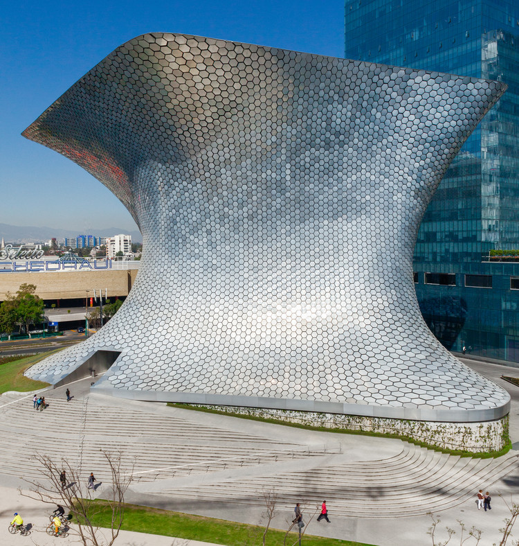
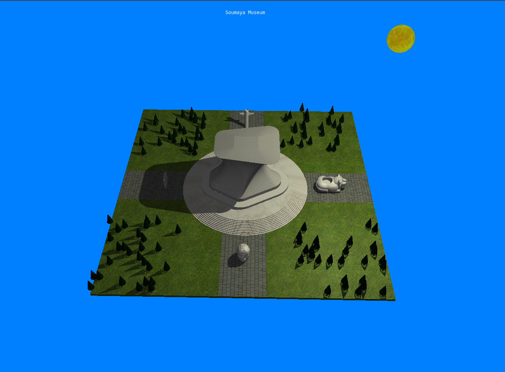

# Introduction to Computer Graphics Final Assessment

Recreation of the Museo Soumaya using Three.js library

Setup Instructions:
1.Download Project
2.Open terminal in directory 
3.In terminal execute: php -S 127.0.0.1:8080
4.Open: http://127.0.0.1:8080/project.html

What we're trying to recreate:

Results:

