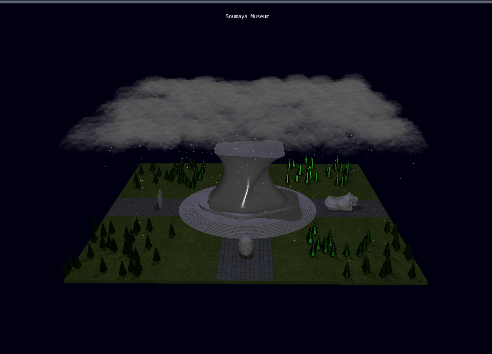

# Introduction to Computer Graphics Final Assessment

<h6>Recreation of the Museo Soumaya using Three.js library</h6>

<h6>Setup Instructions:<h6>
<ol>
<li>Download Project</li>
<li>Open terminal in directory </li>
<li>In terminal execute: php -S 127.0.0.1:8080</li>
<li>Open: http://127.0.0.1:8080/project.html</li>
</ol>

<h6>What we're trying to recreate:</h6>

<h6>Results:</h6>

